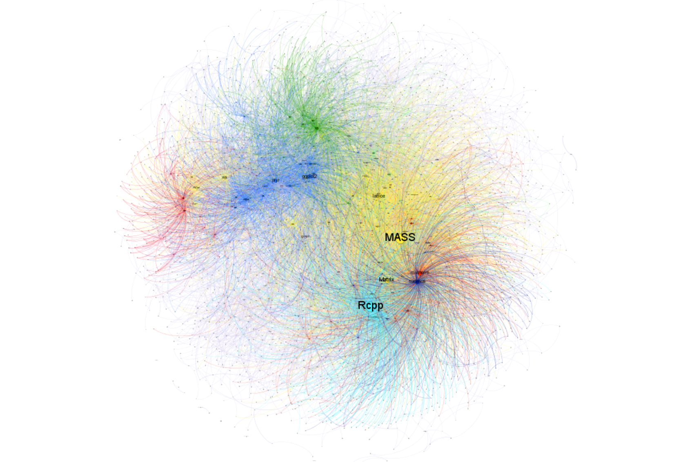

Data Wrangling & Tidy Data in R
========================================================
author: Flic Anderson
date: 29 September 2015
font-import: http://fonts.googleapis.com/css?family=Telex
font-family: 'Telex'

RBGE Code Group 


What IS Data Wrangling?!
========================================================

The process of cleaning, transforming and generally converting raw data into a form which allows easier use later.

For reproducible science, this is best done programmatically.  

R is great for this & there are a few great packages which make life much easier (dplyr, tidyr, reshape/reshape2, etc)  

If you work with data, you probably do a lot of data wrangling - congrats! 


What IS Tidy Data?!
========================================================

Tidy data is a subset of data wrangling.

The aim is to get your untidy raw data into a structure which allows easy analysis

3 principles:
- Each variable forms a column
- Each observation forms a row
- Each type of observational unit forms a table


Common Messy Data Issues
========================================================

Your data might be messy, if:
- 1) Column headings are values, not variable names 
- 2) Multiple variables are stored in one column
- 3) Variables in both rows and columns
- 4) Multiple types of observational units are stored in the same table
- 5) A single observational unit is stored in multiple tables


Let's Go!
========================================================

Install & load packages we'll work with:


```r
# dplyr
if (!require(dplyr)){
  install.packages("dplyr")
  library(dplyr)
} 

# tidyr
if (!require(tidyr)){
  install.packages("tidyr")
  library(tidyr)
} 

# NB: for shorter/simpler code, can just use "library(dplyr)" if it's installed already.
```


A Brief Intro to the Hadleyverse
==========================================================



A Brief Intro to {dplyr}
==========================================================

The {dplyr} package is one of a stable of packages from the 'Hadleyverse'...

Hadley Wickham's packages tend to have a particular grammar which is easy to use & quick to learn.

{dplyr} is a good example - when the grammar *clicks*, it can really simplify your code & make it easier to read & understand.  {tidyr} uses some of the same grammar.


```r
datA <- data(iris)

# ordinary R
###

# dplyr
###
```


Example Data Set: datA
========================================================

This is **randomly generated** botanical survey data, based on my MSc project data


```r
# data frame: 
datA <- data.frame(
        # sampling site codes
        vegplot=c("S1T1A", "S1T1B", "S1T1C"),  
        # elevation of sample
        altM=c(100, 200, 300), 
        # presence values for taxa
        T1=sample(0:1, 3, replace=TRUE),  
        G1=sample(0:1, 3, replace=TRUE),  
        H2=sample(0:1, 3, replace=TRUE),  
        H3=sample(0:1, 3, replace=TRUE)
)
```


Messy Data: Problem 1
========================================================

1) Column headings are values, not variable names

This can be helpful when displaying data, but isn't great for analyses.

Here, the taxa (T1, G1, H2 etc) along the top are technically *values*, not variables.


```
  vegplot altM T1 G1 H2 H3
1   S1T1A  100  1  0  1  0
2   S1T1B  200  1  0  1  0
3   S1T1C  300  0  0  1  0
```


Messy Data: Fix 1
========================================================

- pull species from headings into a column we're calling "taxon"
- 'gather' values under each heading into a column we've called "presence"
- don't gather site codes or altitude! (use minus symbol)


```r
datA <- 
datA %>% 
  gather(taxon, presence, -vegplot, -altM) %>%
  head %>%  # only show first 6 rows
print
```


Messy Data: Fix 1
========================================================

- pull species from headings into a column we're calling "taxon"
- **'gather'** values under each heading into a column we've called "presence"
- don't gather site codes or altitude! (use minus symbol)


```
  vegplot altM taxon presence
1   S1T1A  100    T1        1
2   S1T1B  200    T1        1
3   S1T1C  300    T1        0
4   S1T1A  100    G1        0
5   S1T1B  200    G1        0
6   S1T1C  300    G1        0
```


Messy Data: Problem 2
========================================================

2) Multiple variables are stored in one column

The vegplots variable is made up of a code for each sampling point & represents multiple variables:
- S1 = site 1 [1:3]
- T1 = transect 1  \[1:5] (replicates!)
- A = releve A  [A:F]
We'll need to split these up if we want to compare things like species by site.


```
     [,1]   
[1,] "S1T1A"
[2,] "S1T1B"
[3,] "S1T1C"
[4,] "S1T1A"
[5,] "S1T1B"
[6,] "S1T1C"
```


Messy Data: Fix 2
========================================================

- we separate site, transect & releve data into columns of their own


```r
datA <- 
datA %>% 
  separate(
          # column to split
          vegplot, 
          # new column names
          into=c("site", "transect", "releve"), 
          # numeric/position separator
          sep=c(2, 4), 
          # remove old vegplot column
          remove=TRUE  
          ) %>%
  head %>%   # only show first 6 rows
print
```


Messy Data: Fix 2
========================================================

- we separate site, transect & releve data into columns of their own


```
  site transect releve altM taxon presence
1   S1       T1      A  100    T1        1
2   S1       T1      B  200    T1        1
3   S1       T1      C  300    T1        0
4   S1       T1      A  100    G1        0
5   S1       T1      B  200    G1        0
6   S1       T1      C  300    G1        0
```


Messy Data: Problem 3
========================================================

3) Variables in both rows and columns

TBC


Messy Data: Fix 3
========================================================

- TBC

TBC


Messy Data: Problem 4
========================================================

4) Multiple types of observational units are stored in the same table

Here, we had elevational data (altM) and species data (taxon, presence) stored in the same table.  That's not tidy data!   

Splitting these 'types' of data apart is called 'normalisation' & is done in relational databases


```
  site transect releve altM taxon presence
1   S1       T1      A  100    T1        1
2   S1       T1      B  200    T1        1
3   S1       T1      C  300    T1        0
4   S1       T1      A  100    G1        0
5   S1       T1      B  200    G1        0
6   S1       T1      C  300    G1        0
```


Messy Data: Fix 4
========================================================

Split elevation data (altM) amd species data (taxon, presence) off into separate tables.

```r
# environmental data  
envDat <- 
   datA %>% 
      select(site, transect, releve, altM) %>%
print
```

```
  site transect releve altM
1   S1       T1      A  100
2   S1       T1      B  200
3   S1       T1      C  300
4   S1       T1      A  100
5   S1       T1      B  200
6   S1       T1      C  300
```


Messy Data: Fix 4
========================================================

Split elevation data (altM) amd species data (taxon, presence) off into separate tables.

```r
# species data
spsDat <- 
   datA %>%
      select(site, transect, releve, taxon, presence) %>%
print
```

```
  site transect releve taxon presence
1   S1       T1      A    T1        1
2   S1       T1      B    T1        1
3   S1       T1      C    T1        0
4   S1       T1      A    G1        0
5   S1       T1      B    G1        0
6   S1       T1      C    G1        0
```


Messy Data: Problem 5
========================================================

5) A single observational unit is stored in multiple tables

Sometimes we'll accumulate several files which are often the same type of observation. 

For instance, temperature data from a logger split into separate files by time (Sept2015.csv, Oct2015.csv, etc). 


Messy Data: Fix 5
========================================================

- TBC

TBC


Now What?
========================================================

Now your data is tidy, it's far easier to analyse, plot & share!


```
Error in plot.window(...) : need finite 'xlim' values
```
